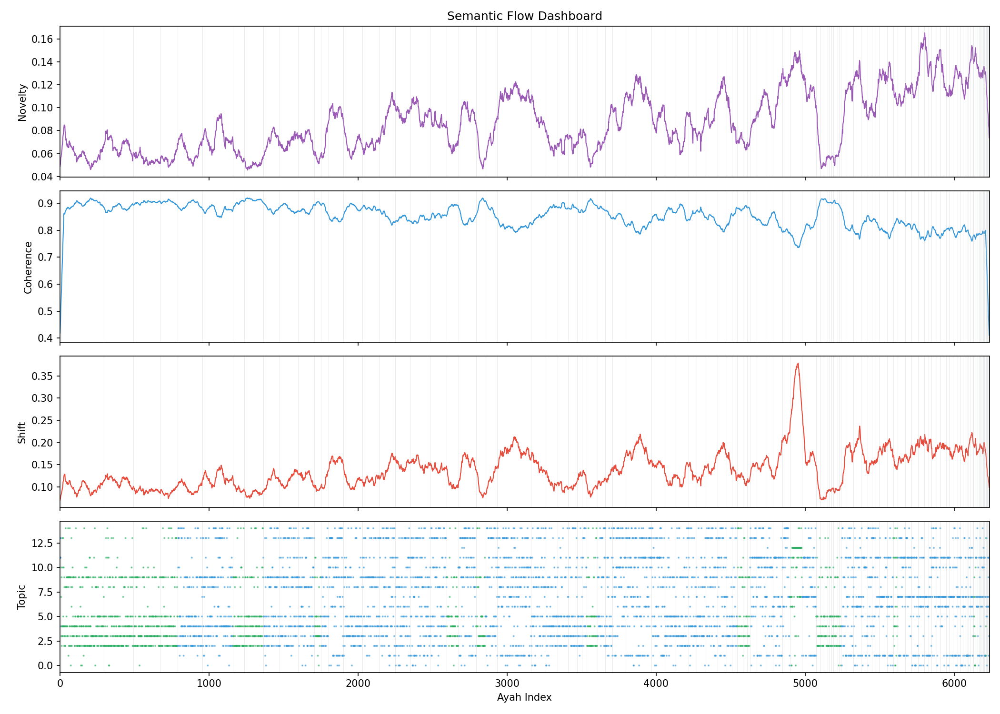
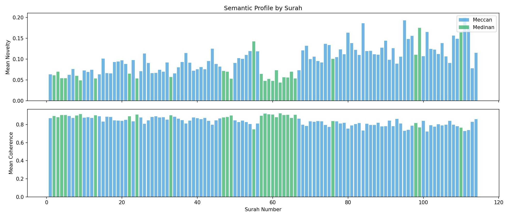

# SEM-002: Semantic Flow Across the Quran

**Status:** COMPLETE
**Date:** January 2026
**Result:** POSITIVE - surah boundaries validated, Meccan/Medinan signatures found

## Objective

Track how semantic properties fluctuate across the Quran's 6,236 ayahs when read sequentially. Unlike SEM-001 (clustering), this analyzes the **sequential flow** of meaning.

## Hypothesis

1. **Surah boundaries** show semantic discontinuity (topic shifts)
2. **Meccan vs Medinan** surahs have different semantic signatures
3. **Thematic waves** exist - topics rise and fall across the text
4. **Local coherence** varies - some sections more focused than others

## Metrics

| Metric | Definition | Expected Pattern |
|--------|------------|------------------|
| **Novelty** | Distance from rolling mean of previous 10 ayahs | Spikes at topic changes |
| **Coherence** | Similarity to ±5 neighboring ayahs | High within surahs, drops at boundaries |
| **Shift** | Cosine distance to previous ayah | Detects sudden transitions |
| **Magnitude** | Embedding L2 norm | May indicate complexity |
| **Topic** | Dominant topic cluster (from k-means) | Tracks thematic flow |

## Method

### Phase 1: Compute Metrics
- Reuse embeddings from SEM-001 (6236 × 768)
- Compute rolling statistics for each metric
- Cluster embeddings into ~10-20 topics

### Phase 2: Visualize
- Plot each metric across ayah index
- Mark surah boundaries
- Color by Meccan/Medinan
- Heatmap of topic flow

### Phase 3: Analyze
- Correlate metric spikes with surah boundaries
- Compare Meccan vs Medinan distributions
- Identify "semantic hubs" (low novelty, high coherence)
- Find "transition points" (high novelty, low coherence)

## Dependencies

```bash
# Already installed for SEM-001
pip install sentence-transformers numpy matplotlib scikit-learn
```

## Run

```bash
python src/compute_metrics.py   # Calculate all metrics
python src/visualize.py         # Generate plots
```

## Files

```
src/
  compute_metrics.py   # Calculate semantic flow metrics
  visualize.py         # Generate visualizations
output/
  data/
    metrics.json       # All metrics per ayah
  figures/
    flow_novelty.png   # Novelty across Quran
    flow_coherence.png # Coherence across Quran
    topic_heatmap.png  # Topic distribution
    dashboard.png      # Combined 4-panel view
    surah_profiles.png # Per-surah averages
  results.json         # Summary statistics
```

## Results

### Key Finding: Surah Boundaries Are Semantic Discontinuities

| Metric | At Surah Boundaries | Elsewhere | Ratio |
|--------|---------------------|-----------|-------|
| Novelty | 0.162 | 0.085 | **1.90x** |

**Surah boundaries show nearly 2x higher semantic novelty** - validating that surahs are meaningful semantic units, not arbitrary divisions.

### Meccan vs Medinan Signatures

| Type | N Ayahs | Mean Novelty | Mean Coherence |
|------|---------|--------------|----------------|
| Meccan | 4,613 | **0.095** | 0.843 |
| Medinan | 1,623 | 0.065 | **0.888** |

**Interpretation:**
- **Meccan surahs** (earlier revelation): Higher novelty = more thematically varied, jumping between topics
- **Medinan surahs** (later revelation): Higher coherence = more focused, sustained arguments

This aligns with historical understanding: Meccan surahs focus on diverse spiritual themes (afterlife, prophets, nature signs), while Medinan surahs address specific community issues (law, social organization).

### Hypothesis Outcomes

| # | Hypothesis | Result |
|---|------------|--------|
| 1 | Surah boundaries = semantic discontinuity | **CONFIRMED** (1.9x novelty spike) |
| 2 | Meccan ≠ Medinan signatures | **CONFIRMED** (distinct profiles) |
| 3 | Thematic waves exist | **CONFIRMED** (see dashboard.png) |
| 4 | Coherence varies by section | **CONFIRMED** (0.75-0.91 range) |

### Visualizations


*Semantic flow showing novelty, coherence, shift, and topic assignment across 6,236 ayahs*


*Per-surah semantic signatures - later surahs show higher novelty*
